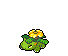
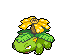
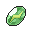
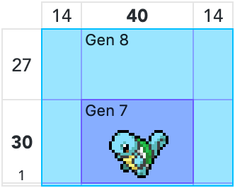
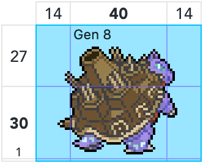
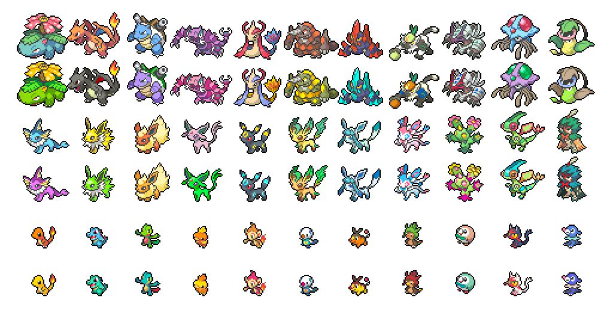

[](https://opensource.org/licenses/MIT) [](https://badge.fury.io/js/pokesprite-images) -blue)

# PokéSprite

This is a collection of the box sprites of every Pokémon from the main game series, and the sprites for every collectable and bag item. Also included are custom shiny versions of the box sprites that are not available in-game.

**Some examples of the sprites:**

<p align="center"></p>

These sprites can be used as individual files, or accessed programmatically using the included sprite database files.

## Sprites and metadata

This project contains both Pokémon box sprites and item sprites. For Pokémon, both the old style sprites from *Pokémon Sun/Moon* (Gen 7) and the new style sprites from *Pokémon Sword/Shield* (Gen 8), including the DLC, are included, as well as a number of unofficial sprites for *Pokémon Legends: Arceus*. Item sprites are available with Gen 8 style white outlines and without.

| Directory | Example | Size | Type | Description |
|:----------|:-------:|:----------|:-----|:------------|
| `/pokemon‑gen7x` |  | 68×56 | Pokémon | [Gen 7 sprites](https://msikma.github.io/pokesprite/overview/dex-gen7.html), updated to Gen 8 size and contrast |
| `/pokemon‑gen8` |  | 68×56 | Pokémon | [Gen 8 sprites](https://msikma.github.io/pokesprite/overview/dex-gen8.html) (plus older Gen 7 sprites where needed) |
| `/items` |  | 32×32 | Items | [Gen 3–8 inventory items](https://msikma.github.io/pokesprite/overview/inventory.html) |
| `/items‑outline` |  | 32×32 | Items | [Gen 3–8 inventory items](https://msikma.github.io/pokesprite/overview/inventory.html) with *Sword/Shield* style outline |
| `/misc` |  | Varies | Misc. | [Miscellaneous sprites](https://msikma.github.io/pokesprite/overview/misc.html) from multiple gens |

The item and miscellaneous sprites are separated by type in subdirectories (e.g. *"berry", "evo-item", "valuable-item", "ribbon",* etc).

Previous generations of games (Gen 1–2 and Gen 3–4) had their own collections of sprites, but these are not included in this project. The original 40×30 Pokémon sprites from Gen 6–7 are kept for legacy purposes in the [`/icons`](icons/) directory.

See the [Pokémon sprite overview page](https://msikma.github.io/pokesprite/overview/dex-gen8.html) for a full list of sprites.

## Data files

Developers who want to use these sprites programmatically might want to look at the `/data/pokemon.json` and `/data/item-map.json` files; the former contains a list of all Pokémon and their associated sprites, and the latter links all sprites in the repo to their internal IDs used in-game.

### Pokémon sprite list

Each entry in the `dex.json` file contains the following data (example):

```js
// ...
{
  "idx": "006",
  "name": {
    "eng": "Charizard",
    "jpn": "リザードン",
    "jpn_ro": "Lizardon"
  },
  "slug": {
    "eng": "charizard",
    "jpn": "riza-don",
    "jpn_ro": "lizardon"
  },
  "gen-7": {
    "forms": {
      "$": {
        "has_female": false,
        "has_right": false
      },
      "mega-x": {
        "has_female": false,
        "has_right": false
      },
      "mega-y": {
        "has_female": false,
        "has_right": false
      }
    }
  },
  "gen-8": {
    "forms": {
      "$": {
        "is_prev_gen_icon": false
      },
      "gmax": {
        "is_prev_gen_icon": false
      },
      "mega-x": {
        "is_prev_gen_icon": true
      },
      "mega-y": {
        "is_prev_gen_icon": true
      }
    }
  }
},
// ...
```

The `name` and `slug` objects contain the Pokémon's name in various languages, including a romanized version of the Japanese name. The **`jpn_ro`** item contains GAME FREAK's official rōmaji names that are mainly used in merchandise. For example, for カメール (Wartortle), the `jpn` slug is *"kame-ru"*, while the `jpn_ro` slug is *"kameil"*.

The **`forms`** object contains a list of all sprites pertaining to a Pokémon. It always contains at least a `"$"` (dollar sign) value, which means the regular form or default sprite. Each form object can contain the following details:

| Key | Meaning |
|:----|:--------|
| `is_alias_of` | This form uses the sprite of another form and does not have its own image |
| `is_unofficial_icon` | This sprite is not a verbatim original and has been edited in some way (e.g. *Pumpkaboo* and *Gourgeist*)† |
| `is_unofficial_legacy_icon` | As above, but only for the smaller legacy 40×30 sprites (only used for *Melmetal*) |
| `is_prev_gen_icon` | This sprite is actually [from an earlier generation](docs/notes/unupdated-sprites.md) |
| `has_right` | A unique right-facing sprite is available (e.g. *Roselia*—only for Gen 7 Pokémon) |
| `has_female` | This Pokémon has visible gender differences (e.g. *Unfezant*) |
| `has_unofficial_female_icon` | The female version of this Pokémon's sprite was custom made (e.g. *Pikachu*) |

<sub>†: only applies to non-shiny sprites, as shiny sprites are always unofficial.</sub>

There are a few cases where a Pokémon's shiny design changed in an update. For example, Minior's shiny form was originally [gray](pokemon-gen8/shiny/minior-blue-gen7.png) but became [colorized](pokemon-gen8/shiny/minior-blue.png) with the release of Pokémon HOME. This project always uses the latest designs, with the old ones renamed to their gen of origin.

### Inventory items list

Several files are available for processing the sprites for inventory items:

* [`/data/item-map.json`](data/item-map.json) – a 1:1 map of item IDs and sprite files, e.g. `"item_0017": "medicine/potion"`
* [`/data/item-unlinked.json`](data/item-unlinked.json) – all inventory sprites not linked to an item ID—these are mostly duplicates (e.g. the *Metal Coat* sprite is in both *"hold-item"* and *"evo-item"*, and so one goes unused) and legacy files
* [`/data/item-legacy.json`](data/item-legacy.json) – a list of old item sprites from previous gen games

See the [inventory overview page](https://msikma.github.io/pokesprite/overview/inventory.html) for a list of items.

### Miscellaneous sprites

For all other sprites that are neither Pokémon nor inventory items, see [`/data/misc.json`](data/misc.json). Notably, the [ribbons](misc/ribbon) can be found there. Each group of miscellaneous sprites has its own unique data format. See the [miscellaneous overview page](https://msikma.github.io/pokesprite/overview/misc.html) for all included images.

## Sprite dimensions

Since Gen 8, the Pokémon box sprites have become 68×56 (up from 40×30 in Gen 7) to accommodate larger sprite designs. 

<p align="center">

&nbsp;&nbsp;&nbsp;

<p>

Most Pokémon did not get a new sprite as of Gen 8, meaning their old sprite was padded to the new size. Sprites were padded from below, with one extra pixel of space on the bottom (see left).

Since most Pokémon take up a very small amount of pixels of the allotted space, they'll look far more spaced apart than in Gen 7 if they're displayed adjacent to each other. This effect is especially noticeable for not-fully-evolved Pokémon.

To somewhat mitigate this, the sprites can be made to overlap each other. In nearly all cases, only the empty space around the sprite will overlap—if there are multiple large sprites next to each other (like several Gigantamax forms) the sprites themselves will overlap, but only a little.

The recommended overlap is **-24px left** and **-16px top**, which is a compromise between bringing the smaller sprites closer together and not letting the larger sprites overlap. **Here's an example of what that looks like:**

<p align="center"></p>

With this setup, the larger sprites are quite close together but not uncomfortably so, and the smaller sprites are not too far away from each other. There is some small overlap for the largest sprites (the special Gigantamax forms), but not excessively so, and in most cases it should be rare to see multiple Gigantamax forms next to one another since it's not a permanent form.

For a better example of what many adjacent sprites look like with this setup, see the banner image at the top of the readme, which also uses the same amount of spacing.

## Related projects

**Projects using PokéSprite:**

* **[PKHeX](https://github.com/kwsch/PKHeX)** – Pokémon save file editor
* **[PokéSprite spritesheet](https://github.com/msikma/pokesprite-spritesheet/)** – spritesheet of all Pokémon box sprites and inventory items for use in websites
* **[PikaSprite](https://github.com/arcanis/pikasprite)** – a different interface for PokéSprite sprites
* **[DexTool](https://github.com/PoshoDev/DexTool)** – management tools for a Pokémon living Dex, shiny hunting and streaming
* [Spinda Painter](https://msikma.github.io/spinda-spots/) – proof of concept for displaying accurate Spinda spots on its box sprite
* [pokemonsay](https://github.com/HRKings/pokemonsay-newgenerations) – version of [cowsay](https://en.wikipedia.org/wiki/Cowsay) with Pokémon sprites
* [pokemonshow](https://github.com/eramdam/pokemonshow) – another project that shows Pokémon in the terminal
* [Random Pokémon Generator](https://ptgigi.com/apps/pokemon/randomizer/) – generates Pokémon teams by a given list of filters
* [Pokémon Type Swap Generator](https://ptgigi.com/apps/pokemon/typeswap/) – a Pokémon type swapping app
* Many Google Sheets used by Pokémon traders

If your project uses PokéSprite and you'd like to be added to this list, feel free to [open an issue](https://github.com/msikma/pokesprite/issues) to request it.

**Other Pokémon artwork related links:**

* [Project Pokémon - Animated 3D sprites index](https://projectpokemon.org/docs/spriteindex_148/)
* [Bulbapedia - List of game sprites](https://archives.bulbagarden.net/wiki/Category:Game_sprites) – contains many other graphics and icons not included in this project
* [PokéDings](https://github.com/msikma/PokeDings) – webfont and SVG icons of special characters used in Pokémon nicknames
* [PokéResources](https://github.com/msikma/pokeresources) – Various Pokémon image resources

## License

The sprite images are © Nintendo/Creatures Inc./GAME FREAK Inc.

Everything else, and the programming code, is governed by the [MIT license](http://opensource.org/licenses/MIT).

This project couldn't have been made without the help of numerous contributions from the community. See [the contributors file](contributors.md) for further information and full credits.
