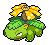

[](https://opensource.org/licenses/MIT)

# PokéSprite

This is a collection of the box sprites of every Pokémon from the main game series, and the icons for every collectable and bag item. Also included are custom shiny versions of the box sprites that are not available in-game.

**Some examples of the sprites:**


These icons can be used as individual files, or accessed programmatically using the included icon database files.

## Icons and metadata

This project contains both Pokémon box sprites and item sprites. For Pokémon, both the old style sprites from *Pokémon Sun/Moon* (Gen 7) and the new style sprites from *Pokémon Sword/Shield* (Gen 8) are included. Item sprites are available with Gen 8 style white outlines and without.

| Directory | Example | Size | Type | Description |
|:----------|:-------:|:----------|:-----|:------------|
| `/pokemon-gen7x` |  | 68×56 | Pokémon | Gen 7 sprites, but padded to Gen 8 size and contrast |
| `/pokemon-gen8` |  | 68×56 | Pokémon | Gen 8 sprites (plus older Gen 7 sprites where needed) |
| `/items` |  | 32×32 | Items | Gen 7–8 inventory items |
| `/items-outline` |  | 32×32 | Items | Gen 7–8 inventory items with *Sword/Shield* style white outline |

The item icons are separated by type in subdirectories (e.g. *"berry", "evo-item", "valuable-item",* etc).

Previous generations of games (Gen 1–2 and Gen 3–4) had their own collections of sprites, but these are not included in this project. The original 40×30 Pokémon sprites from Gen 6–7 are kept for legacy purposes in the `/icons` directory.

## Data files

Developers who want to use these sprites programmatically might want to look at the `/data/dex.json` and `/data/items.json` files; the former contains a list of all Pokémon and their associated icons, and the latter links all icons in the repo to their internal IDs used in-game.

### Pokémon sprite list

Each entry in the `dex.json` file contains the following data (example):

```js
// ...
{
  "idx": "006",
  "name": {
    "eng": "Charizard",
    "jpn": "リザードン",
    "jpn_ro": "Lizardon"
  },
  "slug": {
    "eng": "charizard",
    "jpn": "lizardon",
    "jpn_ro": "lizardon"
  },
  "gen-7": {
    "forms": {
      "$": {
        "has_female": false,
        "has_right": false
      },
      "mega-x": {
        "has_female": false,
        "has_right": false
      },
      "mega-y": {
        "has_female": false,
        "has_right": false
      }
    }
  },
  "gen-8": {
    "forms": {
      "$": {
        "is_prev_gen_icon": false
      },
      "gmax": {
        "is_prev_gen_icon": false
      },
      "mega-x": {
        "is_prev_gen_icon": true
      },
      "mega-y": {
        "is_prev_gen_icon": true
      }
    }
  }
},
// ...
```

The `jpn_ro` item in the `name` and `slug` objects refers to the official romanization of the Pokémon's name, rather than a Hepburn transliteration. For example, アーボック is "Arbok", rather than "Ābokku".

The `forms` object contains a list of all icons pertaining to a Pokémon. It always contains at least a value `$` (dollar sign), which means the regular form or default icon. Each form object can contain the following details:

| Key | Meaning |
|:----|:--------|
| `is_alias_of` | This form uses the sprite of another form and does not have its own image |
| `is_unofficial_icon` | This sprite is not a verbatim original and has been edited in some way (e.g. *Pumpkaboo* and *Gourgeist*)<sup>†</sup> |
| `is_unofficial_legacy_icon` | As above, but only for the smaller legacy 40×30 sprites (only used for *Melmetal*) |
| `is_prev_gen_icon` | This sprite is actually from an earlier generation |
| `has_right` | A unique right-facing icon is available (e.g. *Roselia*—only for Gen 7 Pokémon) |
| `has_female` | A unique female icon is available (e.g. *Unfezant*) |

<sub>†: only applies to non-shiny sprites, as shiny sprites are always unofficial.</sub>

### Inventory items list

Several files are available for processing the icons for inventory items:

* `/data/items-map.json` – a 1:1 map of item IDs and icon files, e.g. `"item_0017": "medicine/potion"`
* `/data/items-unlinked.json` – all inventory icons not linked to an item ID—these are mostly duplicates (e.g. the *Metal Coat* icon is in both *"hold-item"* and *"evo-item"*, and so one goes unused) and legacy files
* `/data/items-legacy.json` – a list of old item icons from previous gen games

## Displaying icons

TODO: write this section.

## Related projects

If your project uses PokéSprite and you'd like to be added to this list, feel free to [open an issue](https://github.com/msikma/pokesprite/issues).

* [PKHeX](https://github.com/kwsch/PKHeX) – Pokémon Save File Editor
* Many Google Sheets used by Pokémon traders

## License

The source icons are © Nintendo/Creatures Inc./GAME FREAK Inc.

Everything else, and usage of the programming code, is governed by the [MIT license](http://opensource.org/licenses/MIT).
